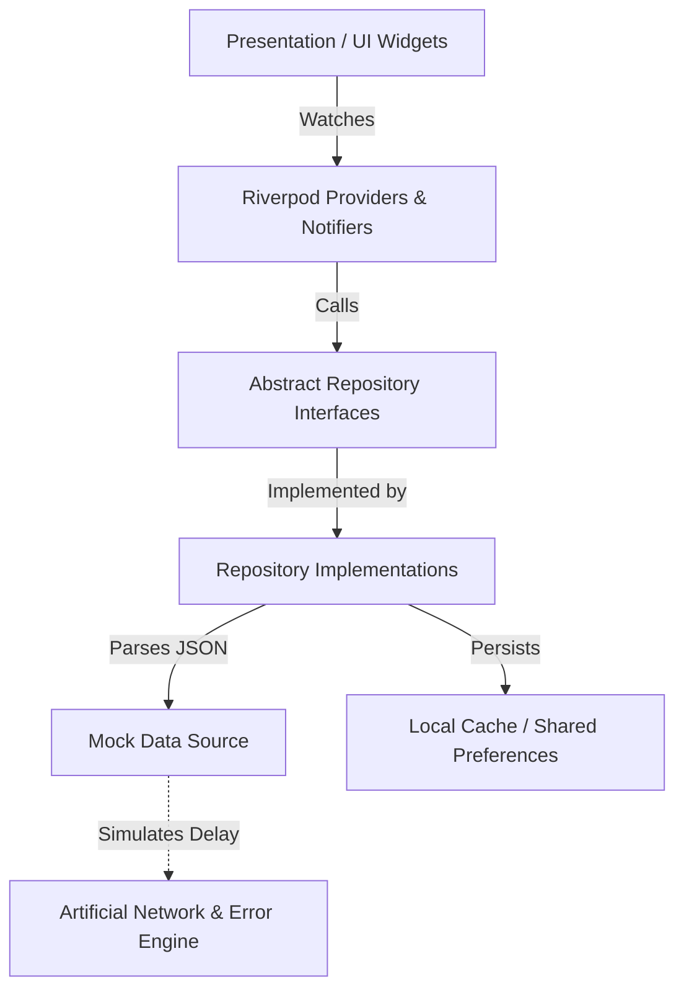

# Architecture Document

## Overview
TaskFlow follows a **Clean Architecture** layered approach paired with a **Feature-First** structure. The primary goal of this architecture is to ensure a strong separation of concerns, high testability, and extreme flexibility so the underlying mock data layer can be seamlessly replaced with a real REST or GraphQL API in the future without touching the UI.

## Architecture Diagram (Conceptual)

## Layers Breakdown

### 1. Presentation Layer (`lib/presentation`)
This layer handles UI rendering and user interactions using standard Flutter widgets.
- It holds no direct business logic.
- It listens to Riverpod `AsyncNotifier` / `StateNotifier` states and rebuilds dynamically using `.when(data: ..., loading: ..., error: ...)`.

### 2. State Management (`lib/presentation/providers`)
**Riverpod 2.0** acts as the glue between the Presentation and Domain layers.
- `AsyncNotifier` is utilized to load and mutate data asynchronously (e.g., `TasksNotifier`).
- It inherently supports caching, cancellation, and granular updates without triggering excessive global `setState` calls.

### 3. Domain Layer (`lib/domain`)
The absolute core of the application that has zero dependency on Flutter or the network.
- **Models**: Defines strictly typed data structures using `Freezed` for immutability and JSON serialization.
- **Repositories**: Exposes interfaces (e.g., `TaskRepository`, `ProjectRepository`). The state management layer talks *only* to these interfaces.

### 4. Data Layer (`lib/data`)
The concrete implementation of the Domain's repository interfaces.
- **MockDataSource**: Parses `assets/mock_data/mock-data.json` exactly once and retains state in memory. Handles the logic for filtering, updating, and simulated network mechanics.
- **Local Cache**: `LocalCacheService` automatically serializes successful API responses into `SharedPreferences` to enable instantaneous offline access.

## Key Technical Decisions & Mechanisms

### Simulated Auth Flow
- On login, the credentials are encrypted (simulated) and an artificial token pair is generated.
- These tokens are securely saved via `flutter_secure_storage`.
- An initialization sequence (`_checkAuth`) attempts a biometric prompt via `local_auth` if a token already exists, automatically redirecting to the dashboard upon success.

### Simulated Offline Mode & Errors
- The architecture handles offline operations seamlessly. When "Simulate Offline" is toggled, all Mock API requests simulate a `SocketException`.
- **SyncService Queue**: In offline mode, write operations (like creating a task) are appended to a JSON queue in `SharedPreferences`. Once re-connected, the app attempts to sync this queue sequentially to the backend.

### Error Handling
- Exceptions generated in the Data Layer are explicitly caught by Riverpod Notifiers.
- The UI layer reads `.error` state and surfaces them gracefully using `ScaffoldMessenger` SnackBar alerts, avoiding raw stack traces on the UI.

### Navigation
- Navigation is strictly decoupled via `go_router`.
- Route guards govern access: attempting to visit `/dashboard` when not authenticated instantly forces a redirect to `/login`.

## Future Improvements
- Swapping `SharedPreferences` for a robust local SQLite wrapper like `Isar` or `sqflite` for complex offline relation lookups.
- Replacing the `MockDataSource` with `Dio` REST clients conforming to the exact same repository interfaces.
